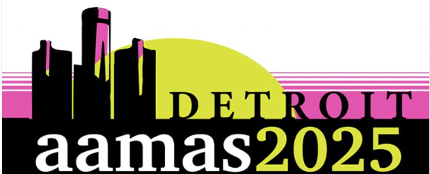
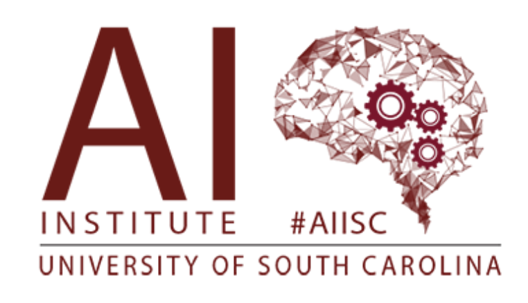
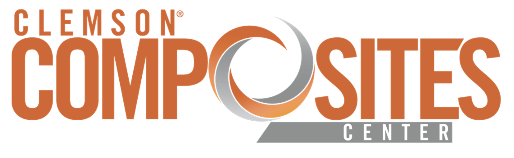
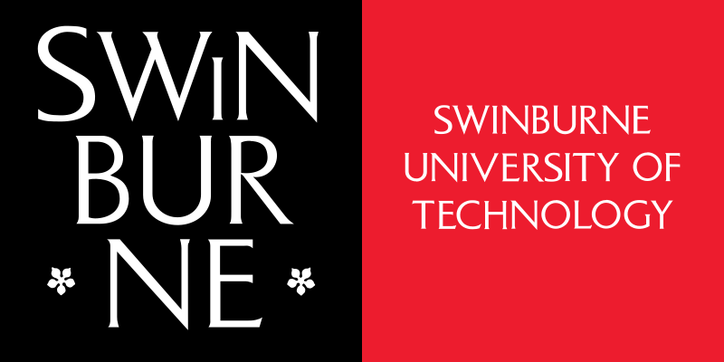
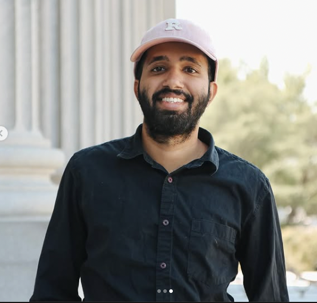
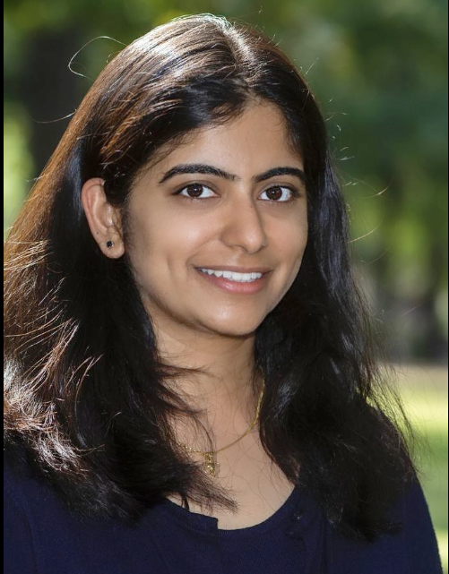
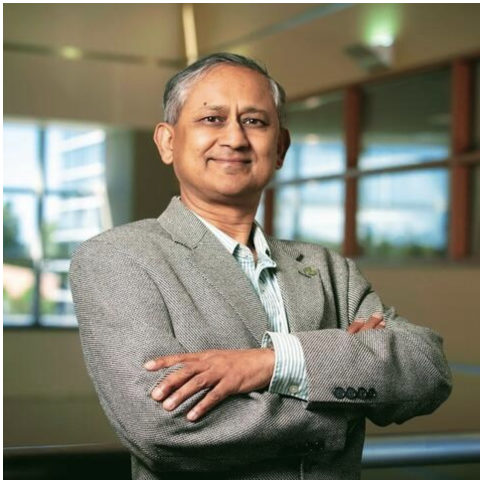

# AAMAS 2025 Tutorial  
## Multiagent CoPilot in Industrial AI Applications

**📍 May 19–23, 2025 | Detroit, Michigan, USA**

### Hosted by:

  

### Collaborators:

  
  

### 🔗 Resources:
- [Tutorial Slides](https://www.canva.com/design/DAGjn2tnlNI/xDOZSfHpokfDim5E8NrVlQ/view?utm_content=DAGjn2tnlNI&utm_campaign=share_your_design&utm_medium=link2&utm_source=shareyourdesignpanel)
- [SmartPilot GitHub Repository](https://github.com/ChathurangiShyalika/SmartPilot)
- [SmartPilot Demo](https://smartpilot.my.canva.site/)

---

## 🧠 Description

In the era of smart automation and digital transformation, achieving efficiency, precision, and adaptability is essential. Industries such as manufacturing, supply chain, healthcare, finance, and retail face significant challenges in deploying tailored AI solutions.

**Composite AI**—integrating machine learning, knowledge graphs, and rule-based systems—is emerging as a foundation for industrial scalability, explainability, and trustworthiness.

This tutorial introduces the **Multiagent CoPilot** for industrial AI, with a focus on manufacturing. Inspired by collaborations with Bosch, HPE, Siemens, and others, we demonstrate human-in-the-loop systems that enhance decision-making, efficiency, and adaptability.

Participants will learn how to build neurosymbolic, agent-driven systems for real-world use in industry, with generalizable methods applicable to sectors like healthcare and transportation.

---

## 🎯 Goals of the Tutorial

Intended for:
- Academic researchers in industrial AI
- Data scientists & ML engineers
- Industry practitioners

Participants will:
- Understand Multiagent CoPilots in industrial AI
- Explore how neurosymbolic AI improves trust and interpretability
- Gain hands-on experience with the SmartPilot system
- Analyze real-world deployment and adaptation challenges

---

## 📅 Detailed Outline of the Tutorial

**Half-day interactive session**

### 🕒 (15 mins) Introduction and Objectives
- Industry 4.0 landscape and neurosymbolic AI foundations

### 🤖 (30 mins) Overview of CoPilots for Industry
- Custom, compact, and neurosymbolic design principles
- Multiagent coordination and collaboration
- Distributed intelligence and domain-specialized reasoning

### 🛠️ (30 mins) Building CoPilots with SmartPilot
- Hands-on demo covering:
  - 🚀 PredictX (Anomaly Detection)
  - 📈 ForeSight (Production Forecasting)
  - 🔍 InfoGuide (Real-Time Explanations)
- Use of knowledge graphs and ontologies

### ⚙️ (30 mins) Incorporating Causality into CoPilots
- 🔬 Causal discovery and effect estimation
- 📖 Causal neurosymbolic reasoning
- 🛠️ Root cause analysis

### 🏭 (30 mins) Real-World Applications
- ✅ Quality estimation
- 🔎 Process defect analysis
- 📊 Optimization strategies

### 🚀 (30 mins) Deployment Challenges
- 🔧 Integration with legacy systems
- 📏 Scalability and performance
- ✅ Best practices for industry deployment

### 💬 (20 mins) Q&A and Open Discussion

---

## 💻 Technical Setup

- Python 3 environment
- Google Colab (preferred)
- PyTorch or TensorFlow
- SmartPilot tools and dependencies

---

## 📚 Supplementary Materials

- **Neurosymbolic Compact CoPilots**  
  Overview of neurosymbolic AI combining logic + learning

- **SmartPilot**  
  [GitHub Repository](https://github.com/ChathurangiShyalika/SmartPilot)  
  [Demo Video](https://www.youtube.com/watch?v=etgkhH_8jS4)

- **Smart Manufacturing Research (AIISC)**  
  [Smart Manufacturing Wiki](http://wiki.aiisc.ai/index.php/Smart_manufacturing)

- **Neurosymbolic AI Research (AIISC)**  
  [Neurosymbolic AI Wiki](https://wiki.aiisc.ai/index.php?title=Neurosymbolic_Artificial_Intelligence_Research_at_AIISC)

- **Previous Tutorials**  
  [AIISC Tutorials](https://aiisc.ai/tutorials.html)

---

## 👩‍🏫 Presenter Biographies

### 🧑‍🔬 Chathurangi Shyalika

<table>
<tr>
<td width="220px">

</td>
<td>

**PhD Student**, AI Institute @ USC  
📫 [LinkedIn](https://www.linkedin.com/in/chathurangi-shyalika-1b89229b/) | [Google Scholar](https://scholar.google.com/citations?user=dnybS1oAAAAJ&hl=en)  
📧 jayakodc@email.sc.edu

</td>
</tr>
</table>

---

### 🧑‍🔬 Renjith Prasad

<table>
<tr>
<td width="220px">

</td>
<td>

**PhD Student**, AI Institute @ USC  
📫 [LinkedIn](https://www.linkedin.com/in/renjithprasadk/) | [Google Scholar](https://scholar.google.com/citations?user=PFeryHoAAAAJ)  
📧 kaippilr@mailbox.sc.edu

</td>
</tr>
</table>

---

### 🧑‍🔬 Utkarshani Jaimini

<table>
<tr>
<td width="220px">

</td>
<td>

**PhD Candidate**, AI Institute @ USC  
📫 [LinkedIn](https://www.linkedin.com/in/utkarshanijaimini/) | [Google Scholar](https://scholar.google.com/citations?user=qKQTw0MAAAAJ)  
📧 ujaimini@email.sc.edu

</td>
</tr>
</table>

---

### 🧑‍🔬 Cory Henson

<table>
<tr>
<td width="220px">

</td>
<td>

**Lead Research Scientist**, Bosch  
📫 [LinkedIn](https://www.linkedin.com/in/cory-henson-9140352/) | [Google Scholar](https://scholar.google.com/citations?user=vdvzlBYAAAAJ)  
📧 cory.henson@us.bosch.com

</td>
</tr>
</table>

---

### 🧑‍🔬 Fadi El Kalach

<table>
<tr>
<td width="220px">

</td>
<td>

**PhD Student**, Automotive Engineering @ Clemson  
📫 [LinkedIn](https://www.linkedin.com/in/fadi-el-kalach-7120b615a/) | [Google Scholar](https://scholar.google.com/citations?user=cpDqs3gAAAAJ)  
📧 felkala@clemson.edu

</td>
</tr>
</table>

---

### 🧠 Prof. Amit Sheth

<table>
<tr>
<td width="220px">

</td>
<td>

**Director**, AIISC  
📫 [Website](https://amit.aiisc.ai) | [LinkedIn](https://www.linkedin.com/in/amitsheth/) | [Google Scholar](https://scholar.google.com/citations?user=2T3H4ekAAAAJ)  
📧 amit@sc.edu

</td>
</tr>
</table>

---

*For questions or setup issues, feel free to reach out to the presenters above.*